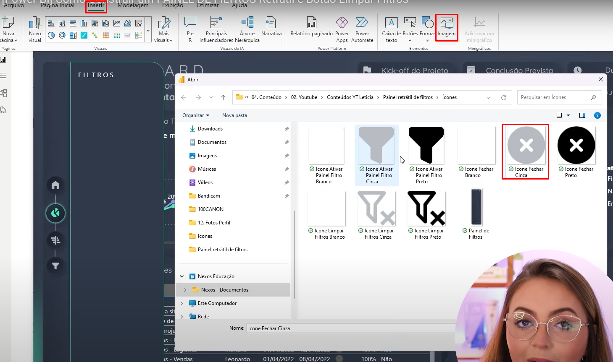

Clique em "Inserir" > Formas > Selecione um tipo papel de parede de fundo para o filtro

Com a forma selecionada clique do lado direito em "Rotação" depois altere a "Forma(°)" para 90°

Clique do lado direito em Forma, altere "Cantos superiores arredondados" para 14, em "Preencher" altere a cor e em "Borda" escolha a cor da borda

Insira um título para o filtro clicando em "Inserir" > "Caixa de Texto", escreva em caixa alta e com espaço entre as letras: "F I L T R O S", selecione a cor da fonte como branca(ou a cor de sua preferência), do lado direito desative a "Tela de Fundo" e posicione o título dentro do fundo do filtro

Insira o a imagem de um "X", este irá ilustrar o botão de fechar o filtro

Posicione o "X"

Insira os filtros e Segmentações de Dados que deseja

Insira também o botão de "Limpar todas as segmentações"

Posicione de pois personalize o botão, mude a cor do texto, o tamanho da fonte e altere o texto dentro do botão

Desative a borda, isso deixa o visual mais clean

Insira o ícone de limpar filtro, deixe esse ícone do lado do texto "Limpar filtros"

Clique em "Exibição" e deixe selecionada a opção "Seleção", na "Ordem das camadas" passe o mouse sobre cada opção disponível, repare que cada opção representa um itém no dashboard, a medida que se passa o mouse o itém fica destacado com um contorno

Com a tecla CRTL pressionada selecione com o mouse todas as camadas que irão ficar dentro do filtro e clique em "Agrupar"

Dê um duplo clique no grupo que contém as camadas do filtro e renomeie o nome do grupo

Clique no olho do lado direito do nome do grupo e repare que, todas as vezes que clicar no olho os filtros iram aparecer e desaparecer 

Ative a aba de "Indicadores", o indicador basicamente irá funcionar como uma foto de cada momento, iremos fazer duas fotos, uma com o filtro exibido e outra com o filtro oculto

Com o olho do "Painel de Filtros" permitindo que o painel fique exibido adicione um Indicador e nomeie esse indicador como "Painel Exibido"

Oculte o painel de filtros e crie um novo indicador, o indicador do "Painel Oculto" que registra o momento em que o filtro está oculto

Insira um botão em branco

Coloque esse botão encima da imagem do filtro e insira uma ação que tenha como "Tipo" "Indicador" e como "Indicador" o "Painel Exibido", sempre que clicar nesse botão o painel será exibido 

Vá até o estilo do botão e remova a borda

Em "Dica de Ferramentas" escreva o texto: "Clique para exibir o painel de filtros", esse texto irá aparecer encima do botão todas vezes a seta do mouse for passada encima do botão

Da mesma forma que criamos um botão para poder abrir o filtro iremos criar um botão para poder fechar o filtro, então com o filtro aberto crie uma nova ação para fechar o filtro

Clique em "Indicadores", depois clique nos 3 pontinhos do lado dois dois paineis e desmarque a opção "Dados" 

Também crie uma ação para o botão que fica encima da imagem que representa a limpeza dos filtros

OBS: Sempre deixar os botões acima das imagens na hierarquia quando for criar os indicadores, é necessário seguir essa premissa para que os botões não fiquem bugados com as imagens

OBS: Quando for clicar nos botões para abrir e fechar o filtro lembre-se de apertar a tecla CRTL

REFERÊNCIAS:

Vídeo Explicativo:
https://www.youtube.com/watch?v=3YMDgM1dLmY

Download das Imagens:
https://drive.google.com/drive/folders/1RIiBR_7tyVhxIfeH89OlbxOAD3jI3gTL?usp=sharing
